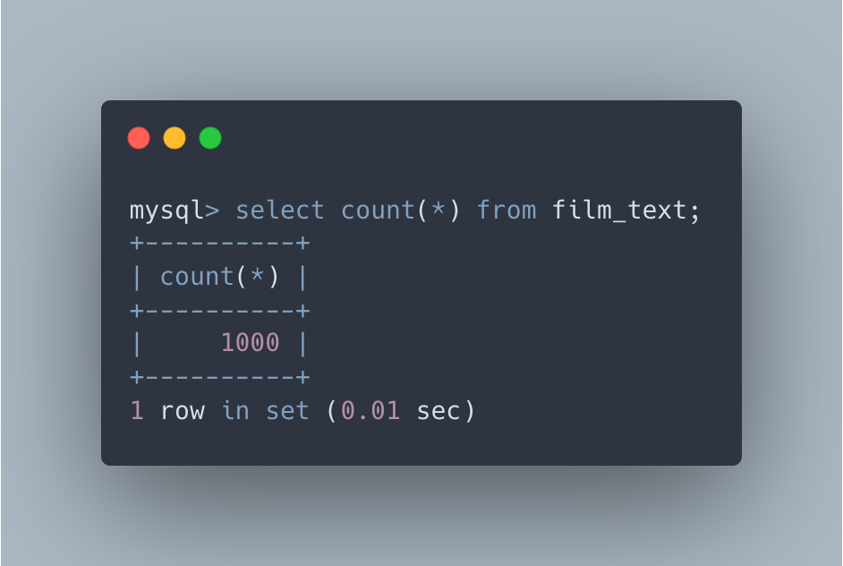

# Sakila

> MySQL database example


### 📦 Getting Started

#### ⚡️ First Steps

To start using this database, you need to lauch with Docker using `docker-compose up -d`.

> Note. To get docker click [here](https://www.docker.com/products/docker-desktop/).

When docker is up and running, you can connect to the database using the following command, writting the password:

```bash
docker-compose exec mysql mysql -u root -p
```

Then you need to upload sql files to the database. You can do this using the following command:

```bash
source ./tmp/sakila-schema.sql;
source ./tmp/sakila-data.sql;
```

Finally, use the database and starts using it:

```bash
USE sakila;
```


### 🚧 Testing Database

When you have finished installing and loading the database, you can start to query sql statements.

For example:

```bash
SELECT COUNT(*) FROM film;
```


```bash
SELECT COUNT(*) FROM film_text;
```



### 🛠 Launch Node

Also, you can launch a node server to test the database.

Before all, you need to install the dependencies:

```bash
npm install
```

Then you can launch the server script:

```bash
npm start
```


### Author

> **Emmanuel Rodriguez** - ⚡️ Software Engineer

<div>
  <a href="https://twitter.com/roremDev">
  	
  </a>
    <a href="https://github.com/roremdev">
  	
  </a>
    <a href="https://medium.com/@roremDev">
  	
  </a>
</div>
